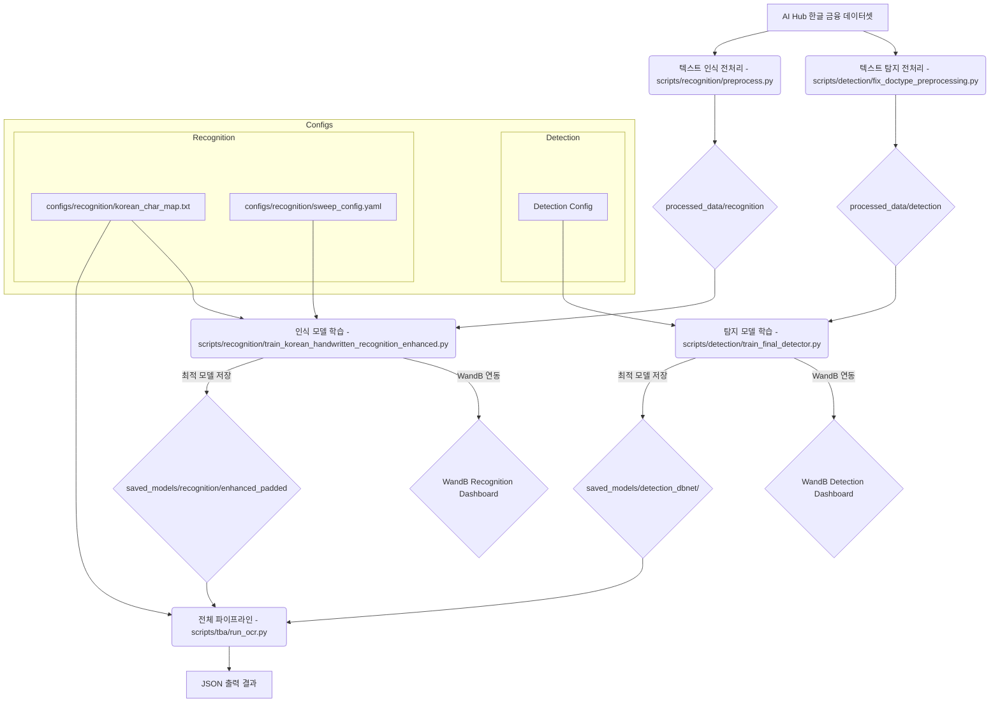
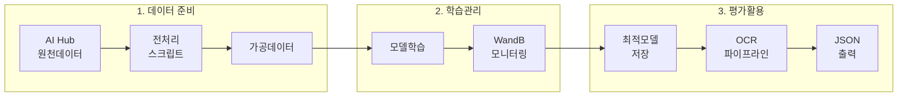

# FinSight: 금융 문서 특화 손글씨 OCR 솔루션 개발

---

## 1. 프로젝트 소개

### 배경 및 목표
최신 LLM(거대 언어 모델)의 OCR 성능이 뛰어나지만, 『개인정보 보호법』과 『금융위원회의 금융분야 AI 가이드라인』에 따라 고객의 민감한 개인정보가 담긴 이미지를 외부 클라우드 서비스(Google, OpenAI 등)에 전송하는 것은 엄격히 제한됩니다. 이로 인해 금융권을 포함한 다수의 기업에서는 AI를 활용한 업무 자동화에 제약을 겪고 있습니다.

이러한 규제 환경 속에서도, 2022년 금융권의 신분증 OCR 서비스 도입을 시작으로 최근에는 NH농협은행 등에서 자체 AI 모델을 활용한 금융 문서 자동화를 추진하는 등, **보안과 성능을 모두 만족하는 자체 구축(On-Premise) AI 모델**에 대한 수요가 급증하고 있습니다. 이는 개인정보를 다루는 모든 산업에서 AI 업무 자동화가 중요한 화두가 될 것을 시사합니다.

따라서 본 프로젝트는 이러한 시장의 요구에 부응하여, **금융 문서에 포함된 손글씨를 정확하게 추출하는 데 특화된 고성능 OCR 엔진을 개발**하는 것을 목표로 합니다.

궁극적으로는 모델의 텍스트 추출 성능을 증명하기 위한 **MVP(Minimum Viable Product)로, 손글씨 문서를 이미지로 입력받아 텍스트를 추출하고, 이를 정해진 디지털 양식에 자동으로 채워 넣는 문서 자동화 서비스**의 핵심 기능을 구현하고자 합니다.

### 기대 효과

#### 1. 강력한 보안 및 규제 준수
모든 데이터 처리와 모델 추론이 외부 클라우드 서비스와의 연결 없이, 100% 독립적인 내부 인프라(On-Premise)에서 이루어집니다. 이를 통해 고객의 민감한 개인정보 및 금융 정보 유출 가능성을 원천적으로 차단하며, 『개인정보 보호법』 등 관련 규제를 완벽하게 준수하여 고객 신뢰도를 확보할 수 있습니다.

#### 2. 혁신적인 업무 효율성 증대
기존에 직원들이 직접 수기 문서를 보고 시스템에 타이핑하던 과정을 자동화하여, **문서 처리 시간을 획기적으로 단축**하고 **인적 오류(Human Error) 발생 가능성을 최소화**합니다. 이를 통해 직원들은 단순 반복적인 데이터 입력 업무에서 벗어나, 고객 응대 및 더 높은 부가가치를 창출하는 업무에 집중할 수 있게 되어 조직 전체의 생산성 향상에 기여합니다.

#### 3. 특정 도메인에서의 압도적인 정확도
범용 OCR 솔루션은 다양한 종류의 문서를 평균적으로 처리하도록 설계되어, 금융권의 특정 서식이나 고객들의 다양한 필기체 인식에는 한계를 보입니다. 본 프로젝트의 모델은 **금융 문서와 손글씨 데이터에 집중적으로 특화 학습**을 진행하므로, 목표 도메인에 한해서는 범용 모델 대비 월등히 높은 인식 정확도를 제공합니다. 오류가 치명적인 결과를 낳을 수 있는 금융 업무에서, 이 높은 정확도는 솔루션의 신뢰도와 직결됩니다.

---

## 2. 시스템 아키텍처

본 프로젝트는 OCR 태스크를 **'글자의 위치를 찾는 문제'**와 **'찾은 글자를 읽는 문제'**로 분리하여 접근하는 **2-Stage OCR 파이프라인** 구조를 채택했습니다. 각 문제에 가장 적합한 전문 모델을 독립적으로 개발하고 조합함으로써, 전체 시스템의 정확도와 안정성을 극대화하는 표준적인 방식입니다.

```text
[ 전체 문서 이미지 ]
        |
        v
+------------------------------------+
|  Stage 1: 텍스트 탐지 (Detection)  |
|  - 모델: DBNet(ResNet-18)          |
|  - 역할: 이미지 속 글씨 영역의     |
|          좌표(Polygon) 찾기        |
+------------------------------------+
        |
        | (탐지된 각 영역의 좌표값 리스트)
        v
+------------------------------------+
|      이미지 잘라내기 (Crop)        |
+------------------------------------+
        |
        | (잘라낸 단어/라인 이미지 배치)
        v
+------------------------------------+
|  Stage 2: 텍스트 인식 (Recognition)  |
|  - 모델: CRNN(EfficientNet-b4)       |
|  - 역할: 글씨 이미지를 텍스트로 변환  |
+------------------------------------+
        |
        v
[ 최종 결과 (JSON 형태의 텍스트와 좌표) ]
```

### 전체 워크플로우 시각화:



### Stage 1: 텍스트 탐지 (Text Detection)
- **Input:** 사용자가 입력한 원본 문서 이미지 (Full-size Image)
- **Process:**
    1. `DBNet` 모델이 이미지 전체를 스캔하여 픽셀 단위로 텍스트일 확률을 계산합니다. (Probability Map 생성)
    2. 텍스트 영역의 경계를 정교하게 분리하는 기준선(Threshold Map)을 학습합니다.
    3. 두 맵을 종합하여 각 텍스트 영역의 정확한 외곽선(Polygon)을 추출합니다.
- **Output:** 이미지 내에서 탐지된 모든 텍스트 영역의 좌표값 리스트 (List of Polygons)

### Stage 2: 텍스트 인식 (Text Recognition)
- **Input:** 1단계에서 탐지된 좌표값을 바탕으로 잘라낸 작은 텍스트 영역 이미지들 (Batch of Cropped Images)
- **Process:**
    1. 잘라낸 각각의 이미지를 `CRNN` 모델에 순차적으로 입력합니다.
    2. CNN(EfficientNet)이 이미지에서 시각적 특징을 추출하여 특징 벡터의 시퀀스로 변환합니다.
    3. BiLSTM이 특징의 순서를 양방향으로 읽으며 문맥 정보를 파악합니다.
    4. CTC Decoder가 최종적으로 가장 확률이 높은 텍스트 시퀀스를 추론합니다.
- **Output:** 각 텍스트 영역 이미지에 해당하는 실제 텍스트 문자열 (Recognized Texts)

### 최종 결과 통합
각 텍스트 영역의 **좌표(from Stage 1)**와 **인식된 텍스트(from Stage 2)**를 하나로 조합하여, `{"box_coordinates": [...], "text": "인식결과"}` 와 같은 구조적인 데이터(예: JSON)로 최종 결과를 생성합니다. 이는 향후 문서 자동 기입 등 다양한 애플리케이션에서 활용하기 용이한 형태입니다.

---

## 3. 구현 모델 상세

### 1) 텍스트 탐지 모델: `DBNet`

DBNet은 복잡한 배경 속에서 텍스트 영역을 정교하고 효과적으로 분리해내는 데 최적화된 모델입니다. 그 구조는 다음과 같은 세 부분으로 구성됩니다.

1.  **Backbone (`ResNet-18`):**
    *   **역할:** 이미지의 원시 픽셀 정보를 입력받아, 색상, 질감, 형태 등 다채로운 시각적 특징(Feature)을 추출하는 역할을 담당합니다.
    *   **선택 이유:** 안정적인 CNN 아키텍처인 `ResNet-18`을 사용하여, 모델 대비 가장 효율적으로 특징을 추출함으로써 후속 단계의 성능을 극대화합니다.

2.  **FPN (Feature Pyramid Network):**
    *   **역할:** Backbone에서 추출된 다양한 크기의 특징 맵(Feature Map)들을 결합하여, 이미지 내의 작은 글씨부터 큰 글씨까지 모두 효과적으로 탐지할 수 있는 다중 스케일 특징 피라미드를 생성합니다.
    *   **강점:** 단일 크기의 특징만 사용하는 모델과 달리, FPN은 이미지의 전체적인 맥락과 국소적인 디테일을 동시에 고려하므로, 다양한 크기의 텍스트가 혼재된 문서 환경에서 탐지 성능을 크게 향상시킵니다.

3.  **DB Head (Differentiable Binarization Head):**
    *   **역할:** FPN으로부터 전달받은 특징을 바탕으로, 픽셀 단위로 해당 위치가 텍스트일 확률(Probability Map)과 텍스트의 경계를 구분하는 기준선(Threshold Map)을 동시에 예측합니다.
    *   **핵심 기술:** 이 두 개의 맵을 동적으로 결합하는 '미분 가능한 이진화' 과정을 통해, 후처리 과정 없이도 글자들이 빽빽하게 붙어 있거나 곡선으로 휘어진 경우에도 각 텍스트의 영역을 매우 정밀하게 분리해냅니다. 이는 최종 바운딩 박스의 정확도를 결정하는 핵심적인 부분입니다.

### 2) 텍스트 인식 모델: `CRNN`

CRNN은 탐지된 텍스트 영역 이미지로부터 실제 문자열을 읽어내는 모델로, 시각 정보와 순차 정보를 결합하여 손글씨의 다양성에 강인하게 대처합니다.

1.  **CNN Backbone (`EfficientNet-B4`):**
    *   **역할:** 잘라낸 텍스트 영역 이미지를 입력받아, 각 문자의 형태, 획의 방향 등 시각적 특징들을 추출하여 특징 벡터의 시퀀스(Sequence of Feature Vectors)로 변환합니다. 즉, 이미지를 RNN이 읽을 수 있는 '특징의 나열' 형태로 변환하는 번역기 역할을 합니다.
    *   **선택 이유:** `EfficientNet`은 높은 정확도와 연산 효율성 사이의 최적의 균형을 제공하여, 제한된 리소스 환경에서도 빠르고 정확한 특징 추출을 가능하게 합니다.

2.  **RNN Sequence Encoder (`Bidirectional LSTM`):**
    *   **역할:** CNN이 추출한 특징 시퀀스를 입력받아, 각 특징 벡터의 문맥을 학습합니다.
    *   **핵심 기술:** **양방향(Bidirectional)**으로 시퀀스를 읽기 때문에, 특정 문자를 인식할 때 그 앞에 나온 문자뿐만 아니라 뒤에 나올 문자까지 함께 고려합니다. 예를 들어, '호'와 '히'처럼 유사한 자음 'ㅎ'을 구분할 때, 뒤따라오는 모음의 형태까지 참고하여 최종 결정을 내리므로 인식 정확도가 크게 향상됩니다.

3.  **CTC Decoder (`Connectionist Temporal Classification`):**
    *   **역할:** BiLSTM이 출력한 문맥 정보 시퀀스를 최종적인 텍스트 라벨로 변환하는 역할을 합니다.
    *   **강점:** 글자 사이의 간격이 불규칙하거나, 같은 글자가 반복되는 경우(예: '진행중...')에도 별도의 위치 지정 정보 없이 올바른 텍스트를 추론해냅니다. 이는 각 스텝에서 어떤 문자가 나타날 확률을 계산한 뒤, 전체 시퀀스에서 가장 가능성 높은 텍스트를 조합해내는 방식으로 동작하기에 가능하며, 정형화되지 않은 손글씨 인식에 필수적인 요소입니다.

---

## 4. 프로젝트 워크플로우 및 사용법

본 프로젝트의 전체 워크플로우는 **`0. 사전 준비` → `1. 데이터 준비` → `2. 모델 학습` → `3. 모델 평가`** 의 4단계로 구성됩니다.

### 0. 사전 준비 (Prerequisites)

본격적인 시작에 앞서, 프로젝트 실행에 필요한 기본적인 환경을 설정합니다.

1.  **프로젝트 복제 (Clone)**
    ```bash
    git clone https://github.com/FingSight-ML/FingSight-OCR-AlpinaDolce.git
    cd FingSight-OCR-AlpinaDolce
    ```

2.  **필요 라이브러리 설치**
    ```bash
    pip install -r requirements.txt
    ```

3.  **데이터 다운로드 및 배치**
    *   [AI Hub](https://www.aihub.or.kr/)에서 **「OCR 데이터(금융 및 물류)」** 데이터셋을 다운로드합니다.
    *   다운로드한 원본 데이터(이미지, JSON 라벨 등)를 프로젝트 루트의 `./data` 디렉토리 내에 배치합니다.

4.  **WandB 로그인 (선택 사항)**
    *   학습 과정을 `wandb`로 로깅하려면, 해당 서비스에 가입 후 API 키를 발급받아 로그인합니다.
    ```bash
    wandb login
    ```

---

### 1. 데이터 준비 (Data Preparation)

*   **목표:** 원본 데이터셋을 각 모델(탐지, 인식)의 학습에 적합한 포맷으로 가공합니다.
*   **프로세스:** **탐지 모델**을 위한 데이터 전처리 `scripts/detection/fix_doctype_preprocessing.py` 스크립트 및 **인식 모델**을 위한 데이터 전처리 `scripts/recognition/preprocess.py`를 실행하여 AI Hub의 원본 데이터를 처리합니다. 이 과정은 탐지 모델과 인식 모델이 필요로 하는 데이터의 형태가 다르기 때문에 필수적입니다.
    *   **탐지 모델용:** 이미지 내 텍스트의 위치를 폴리곤 좌표로 학습해야 합니다.
    *   **인식 모델용:** 잘라낸(cropped) 글자 이미지와 해당 글자의 텍스트 라벨이 쌍으로 필요합니다.
*   **결과물:**
    *   `./processed_data/detection`: 탐지 모델 학습을 위한 이미지 및 폴리곤 라벨(.txt) 파일들이 생성됩니다.
    *   `./processed_data/recognition`: 인식 모델 학습을 위한 잘라낸 글씨 이미지 및 라벨(.csv) 파일이 생성됩니다.

- 탐지 모델용

```bash
python scripts/detection/fix_doctype_preprocessing.py
```

- 인식 모델용

```bash
python scripts/recognition/preprocess.py
```

---

### 2. 모델 학습 (Model Training)

*   **목표:** 준비된 데이터를 사용하여 탐지 모델과 인식 모델을 각각 훈련시키고, 검증 손실(Validation Loss)이 가장 낮은 최적의 모델 가중치를 저장합니다.
*   **프로세스:** 각 `train` 스크립트를 실행합니다. 모든 학습 과정과 결과(손실, 정확도 등)는 `wandb`에 자동으로 기록되어 실시간으로 대시보드에서 확인할 수 있습니다.
*   **결과물:**
    *   `./saved_models/detection_dbnet/dbnet_a100_best.pth`: 탐지 모델 훈련 진행 후 나오는 최적 모델 저장 파일이 생성됩니다.
    *   `./saved_models/recognition/enhanced_padded/robust_korean_recognition_best.pth`: 인식 모델 훈련 진행 후 나오는 최적 모델 저장 파일이 생성됩니다.


#### 가. 탐지 모델 학습

```bash
python scripts/detection/train_final_detector.py --train_data_dir "processed_data/detection/train_images" --val_data_dir "processed_data/detection/val_images" --wandb_project "Korean-Handwriting-Detection-Enhanced"
```

```bash
# A100 훈련용
python dbnet_a100_optimized.py
```

#### 나. 인식 모델 학습

```bash
python scripts/recognition/final.py --train_data_dir "processed_data/recognition/train_images" --val_data_dir "processed_data/recognition/val_images" --wandb_project "Korean-Handwriting-Recognition-Enhanced"
```

```bash
# A100 훈련용
python recognition_a100_optimized.py
```

---

### 3. 모델 파이프라인 (Model PipeLine)

*   **목표:** 학습된 탐지 및 인식 모델을 통합하여 전체 OCR 파이프라인의 동작을 확인하고, 실제 데이터에 대한 텍스트 추출 성능을 검증합니다.
*   **프로세스:** 학습된 탐지 모델과 인식 모델의 가중치 파일(.pth)을 사용하여 `run_ocr.py` 스크립트를 실행합니다. 이 스크립트는 입력 이미지에 대해 텍스트 탐지 및 인식을 순차적으로 수행하여 최종 OCR 결과를 출력합니다.

#### 모델 파이프라인 구동

```bash
python scripts/tba/run_ocr.py --det_weights "saved_models/detection_dbnet/dbnet_a100_best.pth" --rec_weights "saved_models/recognition/enhanced_padded/robust_korean_recognition_best.pth" --source "C:/Users/Admin/Documents/GitHub/FinSight-OCR-AlpinaDolce/data/Validation/01.원천데이터/VS_금융_2.보험_2-5.청구서/IMG_OCR_6_F_0001515.png" --char_map "configs/recognition/korean_char_map.txt"
```

---

## 5. MLOps 워크플로우

본 프로젝트는 실제 배포 환경이 아닌 로컬 환경에서 모델 개발의 전 과정을 체계적으로 관리하고 재현성을 확보하는 데 중점을 둔 MLOps 워크플로우를 구축했습니다. Docker와 같은 배포 기술 대신, 데이터 처리, 학습, 평가, 결과 확인에 이르는 파이프라인을 명확히 정의하고, 각 단계의 산출물을 추적하는 것을 목표로 합니다.

### 로컬 MLOps 파이프라인 시각화

아래 다이어그램은 원본 데이터가 입력되어 최종 OCR 결과로 출력되기까지의 전체 과정을 보여줍니다.



### 단계별 상세 워크플로우

1.  **데이터 준비 및 버전 관리 (Data Preparation & Versioning)**
    *   `./data` 디렉토리에 위치한 AI Hub 원본 데이터를 `scripts/detection/fix_doctype_preprocessing.py` 와 `scripts/recognition/preprocess.py` 스크립트를 사용하여 각 모델에 맞는 학습 형태로 가공합니다.
    *   가공된 데이터는 `processed_data`에 저장되며, 이 과정을 통해 데이터 처리의 재현성을 확보합니다. 데이터의 변경 이력을 추적하기 위해 DVC와 같은 도구를 도입하는 것을 고려할 수 있습니다.

2.  **실험 및 학습 관리 (Experiment & Training Management)**
    *   모든 모델 학습(`train` 스크립트) 과정은 **WandB(Weights & Biases)** 와 연동하여 체계적으로 관리됩니다.
    *   학습 중 발생하는 **Validation Loss**, **CER(Character Error Rate)** 등 핵심 성능 지표를 실시간으로 모니터링하고 시각화하여 모델의 성능을 직관적으로 파악합니다.
    *   `configs/recognition/sweep_config.yaml`와 같은 설정 파일을 통해 하이퍼파라미터 튜닝(Sweep)을 자동화하고, 최적의 파라미터 조합을 탐색한 모든 기록을 WandB에 저장하여 실험의 투명성을 높입니다.

3.  **모델 평가 및 로컬 서빙 (Model Evaluation & Local Serving)**
    *   WandB 대시보드에서 가장 우수한 성능(예: 가장 낮은 CER)을 보인 모델의 가중치(`dbnet_best.pth`, `korean_recognition_best_padded.pth`)를 `saved_models` 디렉토리에 저장합니다.
    *   최종 선택된 모델을 활용하여 `scripts/tba/run_ocr.py` 파이프라인을 실행, 이미지에 대한 최종 OCR 결과를 로컬 환경에서 직접 확인할 수 있습니다.
    *   추가적으로, 학습된 모델을 FastAPI와 연동하여 로컬 환경에서 API 형태로 손쉽게 테스트할 수 있는 환경을 구축했습니다.

4.  **재학습 및 문서화 (Retraining & Documentation)**
    *   새로운 데이터가 추가되거나, 특정 유형의 문서에서 성능 저하가 발견될 경우, 1~3의 과정을 반복하여 모델을 개선하는 재학습 루프를 따릅니다.
    *   이 모든 과정과 실험 결과, 최종 모델의 성능은 프로젝트 발표 자료 및 본 `README.md`와 같은 기술 문서로 정리하여 프로젝트의 진행 상황과 성과를 공유합니다.

---

## 6. 프로젝트 정보

### 개발 환경

본 프로젝트의 모델 학습 및 평가는 아래와 같은 환경에서 진행되었습니다.

*   **H/W**
    *   **GPU:** NVIDIA GeForce RTX 3060 (12GB)

*   **S/W**
    *   **OS:** Windows 11
    *   **Language:** Python 3.9+
    *   **Framework & Libraries:**

가상환경 생성

```bash
conda create -n <가상환경이름> python=3.9
```

가상환경 생성 후 가상환경 진입

```bash
conda activate <가상환경이름>
```

가상환경 진입 후 torch 설치

```bash
pip install torch==2.1.0+cu121 torchvision==0.16.0+cu121 torchaudio==2.1.0+cu121 --index-url https://download.pytorch.org/whl/cu121
```

torch 설치 후 requirements.txt 설치

```bash
pip install -r requirements.txt
```

| Library | Version | Description |
|---|---|---|
| `PyTorch` | 2.1+ | 딥러닝 메인 프레임워크 |
| `timm` | 0.9.12+ | PyTorch 이미지 모델 라이브러리 (백본으로 사용) |
| `wandb` | 0.17.0+ | 실험 관리 및 시각화 도구 |
| `OpenCV` | 4.8.1+ | 이미지 처리 및 데이터 증강 |
| `kornia` | 0.7.2+ | GPU 기반 고속 이미지 증강 라이브러리 |
| `pandas` | 2.2.2+ | 데이터 라벨(.csv) 처리 및 분석 |
| `python-Levenshtein` | 0.25.1+ | 문자 에러율(CER) 계산 |

> 전체 라이브러리 및 정확한 버전 정보는 `requirements.txt` 파일을 참고해 주십시오.

*   **Development Tools:**
    *   Visual Studio Code, Git, GitHub, Docker, Figma

### 팀: FinSight
| 팀원명 | 직책 | 메인 업무 분장 |
|---|---|---|
| 경준오 | 팀장, 프론트엔드 | 프로젝트 전체 관리, 모델 탐색 및 학습, 프론트엔드 지원 |
| 강성룡 | 프론트엔드 총괄 | 모델 탐색 및 학습, 프론트엔드 총괄, 깃허브 관리 |
| 김선우 | 백엔드 총괄 | 모델 탐색 및 학습, 백엔드 총괄 |
| 김태식 | 백엔드 | 모델 탐색 및 학습, 백엔드 |
| 백승빈 | 백엔드 | 모델 탐색 및 학습, 백엔드 |
