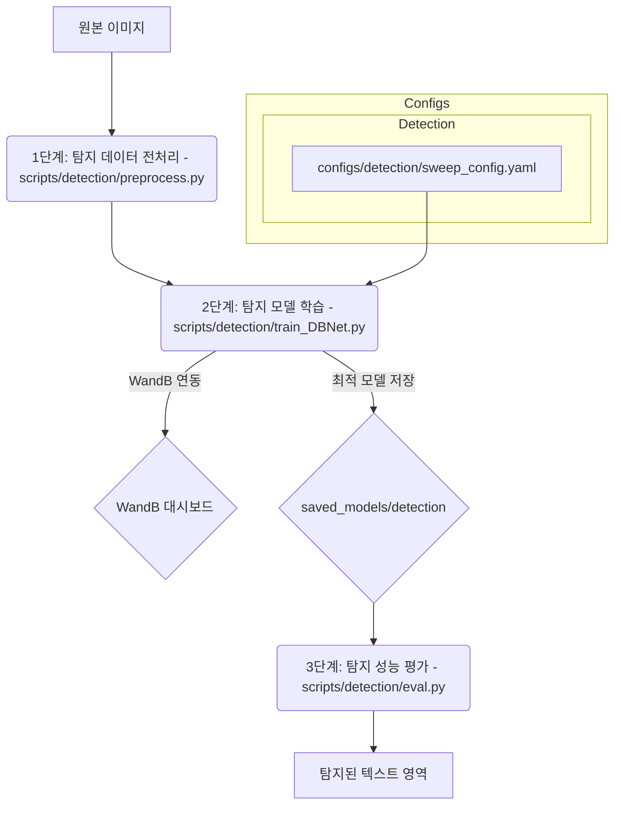

<h2>한글 금융 문서 OCR 탐지 모델 가이드</h2>
작성자: Alpine_Dolce&nbsp;&nbsp;|&nbsp;&nbsp;최종 업데이트: 2025-09-11

<h2>문서 목표</h2>
이 문서는 한글 금융 문서 OCR 시스템의 텍스트 탐지 모델 개발 과정을 상세히 다룹니다. 2단계 파이프라인(텍스트 탐지 + 텍스트 인식) 중 탐지 단계에 해당하며, AI Hub 한글 금융 데이터셋을 사용하여 ResNet18 기반 DBNet 모델로 문서 이미지에서 텍스트 영역을 정확하게 찾아내는 과정을 다룹니다.

**시스템 아키텍처:**
- **전체 시스템**: 2단계 OCR 파이프라인 (탐지 → 인식)
- **탐지 모델**: DBNet with ResNet18 backbone
- **대상 데이터**: AI Hub 한글 금융 문서 데이터셋 (은행 신고서, 보험 서류 등)
- **주요 특징**: 200등분 데이터셋으로 고속 훈련, GPU 최적화, 44,984개 훈련 데이터를 200개 단위로 분할

**프로젝트 구조:**
```
FingSight-OCR-AlpineDolce/
├── data/                  # 원본 데이터셋 (학습/검증 이미지 및 라벨)
├── processed_data/        # 전처리된 데이터셋 (cropped images, labels.csv)
│   ├── detection/         # 탐지 모델용 전처리 데이터
│   └── recognition/       # 인식 모델용 전처리 데이터
├── saved_models/          # 학습된 모델 가중치 저장
│   ├── detection/         # 탐지 모델 가중치
│   └── recognition/       # 인식 모델 가중치
├── scripts/               # 각종 스크립트 (전처리, 학습, 평가 등)
│   ├── detection/         # 탐지 모델 관련 스크립트
│   │   ├── preprocess.py # 탐지 데이터 전처리 스크립트 
│   │   ├── train_DBNet.py # ResNet18 백본 DBNet 학습 스크립트
│   │   └── eval.py       # 탐지 모델 평가 스크립트
│   └── recognition/       # 인식 모델 관련 스크립트
│       ├── preprocess.py       # 데이터 전처리
│       ├── train_resnet_ctc.py # 메인 학습 스크립트
│       └── test_ocr.py         # 모델 평가/추론 스크립트
├── configs/               # 모델 및 학습 설정 파일
│   ├── detection/         # 탐지 모델 설정
│   │   └── sweep_config.yaml # 탐지 모델 WandB 스윕 설정 
│   └── recognition/       # 인식 모델 설정
│       ├── sweep_config.yaml   # WandB 하이퍼파라미터 스윕 설정
│       └── korean_char_map.txt # 한국어 문자 맵 파일
├── output/                # 추론 결과, 시각화 등 출력
├── wandb/                 # WandB 로컬 로그 및 캐시
└── guide/ 
    ├── detection_Model.md # 현재 문서
    └── recognition_Model.md    # 인식 모델 문서
```

**최종 목표:** `DBNet (백본: ResNet18)` 아키텍처 기반의 텍스트 탐지 모델을 개발하고, `wandb`를 통해 학습 과정을 체계적으로 시각화하며, 실제 테스트 환경에서의 탐지 성능을 검증하는 것을 목표로 합니다. 200등분 데이터셋 학습을 통해 RTX 3060 환경에서 이미지 내 텍스트 영역을 효율적이고 정확하게 찾아내는 모델을 구축하기 위함입니다.

**최신 명령어 예시 (2025-09-11 기준):**
```bash
# 데이터 전처리
python scripts/detection/preprocess.py --raw_data_dir "./data" --output_dir "./processed_data/detection"

# DBNet 모델 학습
python scripts/detection/train_DBNet.py --data_dir "processed_data/detection" --save_dir "saved_models/detection" --backbone "resnet18" --batch_size 8 --epochs 200 --wandb_project "FinSight-OCR-Detection"

# 탐지 모델 평가
python scripts/detection/eval.py --weights "saved_models/detection/dbnet_resnet18_best_RUN-ID.pth" --source "path/to/test_images"
```

---

### 전체 워크플로우 시각화:


---

### 1단계: 탐지 데이터 전처리 (학습 전 필수 과정)

텍스트 탐지 모델 학습을 위해서는 원본 이미지에서 텍스트 영역의 위치(바운딩 박스 또는 폴리곤)를 정확하게 주석(annotation)하는 과정이 필수적입니다. 이 단계는 모델이 이미지 내 텍스트의 위치를 학습할 수 있도록 데이터를 준비하는 역할을 합니다.

- **사용 스크립트:** `scripts/detection/preprocess.py`
- **실행 명령어 (예시):**
    ```bash
    python scripts/detection/preprocess.py --raw_data_dir ./data --output_dir ./processed_data/detection
    ```
- **작업 내용:** 원본 데이터셋을 읽어, `DBNet` 학습에 필요한 이미지와 폴리곤 라벨 파일을 생성합니다. 라벨은 각 이미지 파일명과 동일한 이름의 `.txt` 파일로 저장되어야 합니다.
- **출력 결과 (예시):**
    - `processed_data/detection/train_images/`: 학습용 이미지 (`*.jpg`)
    - `processed_data/detection/train_labels/`: 학습용 주석 파일 (`*.txt`)
    - `processed_data/detection/val_images/`: 검증용 이미지 (`*.jpg`)
    - `processed_data/detection/val_labels/`: 검증용 주석 파일 (`*.txt`)
- **주석 파일 형식 (`.txt` 파일 내용):** 각 줄에 하나의 폴리곤(텍스트 영역)을 정의합니다.
    ```
    x1,y1,x2,y2,x3,y3,x4,y4
    x1,y1,x2,y2,x3,y3,x4,y4
    ...
    ```

---

### 2단계: 탐지 모델 학습 (WandB 연동)

`DBNet` 모델을 학습하여 이미지 내 텍스트 영역을 탐지하는 능력을 훈련합니다. 학습 과정은 `wandb`와 연동되어 실시간으로 모니터링됩니다.

- **사용 스크립트:** `scripts/detection/train_DBNet.py`
- **모델 구조:** `DBNet (백본: ResNet18 또는 ConvNeXt-Tiny)`
- **구현 특징:**
    - **백본:** `timm` 라이브러리를 통해 `ResNet18` 또는 `ConvNeXt-Tiny`를 백본으로 사용합니다. (기본값: `resnet18`)
    - **데이터 증강:** `kornia`를 활용한 GPU 기반 증강 (`RandomAffine`, `ColorJitter`, `GaussianBlur`)을 적용하여 학습 효율을 높입니다.
    - **학습 최적화:**
        - **혼합 정밀도 학습 (AMP):** `torch.cuda.amp`로 VRAM 사용량을 줄이고 학습 속도를 향상시킵니다.
        - **그래디언트 누적:** 배치 사이즈를 늘리지 않고도 안정적인 학습을 위해 그래디언트를 여러 스텝에 걸쳐 누적합니다.
        - **200등분 데이터셋 학습:** 44,984개 훈련 데이터를 200개 단위로 분할하여 각 에포크당 약 225개 데이터를 학습합니다.
    - **WandB 연동:** 학습/검증 손실, 학습률을 기록하고, 검증 과정에서 생성된 예측 결과 맵을 이미지로 로깅하여 정성적 평가를 지원합니다.
    - **최고 모델 저장:** 검증 손실(val_loss)을 기준으로 가장 성능이 좋은 모델 가중치를 `saved_models/detection`에 자동으로 저장합니다.

- **실행 방법:**
    ```bash
    python scripts/detection/train_DBNet.py --data_dir "processed_data/detection" --save_dir "saved_models/detection" --backbone "resnet18" --batch_size 8 --epochs 200 --wandb_project "FinSight-OCR-Detection"
    ```
- **주요 인자:**
    - `--data_dir`: 전처리된 데이터가 있는 경로 (기본값: `processed_data/detection`).
    - `--save_dir`: 모델 가중치를 저장할 경로 (기본값: `saved_models/detection`).
    - `--backbone`: 백본 네트워크 (예: `resnet18`, `convnext_tiny`). (기본값: `resnet18`).
    - `--img_size`: 학습에 사용할 이미지 크기 (기본값: `640`).
    - `--epochs`: 총 학습 에포크 수 (기본값: `200`). 200등분 데이터셋으로 실제로는 짧은 훈련 시간.
    - `--batch_size`: 배치 사이즈 (기본값: `8`, RTX 3060 환경에 맞게 조정 필요).
    - `--num_splits`: 데이터셋 분할 수 (기본값: `200`). 전체 데이터를 몇 개로 나눌지 설정.
    - `--accumulation_steps`: 그래디언트 누적 스텝 수 (기본값: `4`). 실질적 배치는 `batch_size * accumulation_steps`.
    - `--lr`: 학습률 (기본값: `1e-4`).
    - `--patience`: 조기 종료를 위한 patience (기본값: `15`).
    - `--wandb_project`: WandB에 로깅할 프로젝트 이름 (기본값: `FinSight-OCR-Detection`).

---

### 3단계: 탐지 성능 평가 (학습 완료 후 진행)

학습된 모델의 성능을 정성적(시각화) 및 정량적(성능 지표)으로 평가합니다.

- **사용 스크립트:** `scripts/detection/eval.py`
- **작업 내용:**
    1.  학습된 모델 가중치(`.pth`)를 불러옵니다.
    2.  테스트 이미지에 대해 텍스트 영역을 추론합니다.
    3.  추론된 폴리곤을 원본 이미지 위에 그려 시각화하고 `output/detection`에 저장합니다.
    4.  (선택) Ground Truth 라벨이 제공되면, **Precision, Recall, F1-Score**를 계산하여 정량적 성능을 출력합니다.

- **실행 방법:**
    - **시각화 결과만 확인할 경우:**
        ```bash
        python scripts/detection/eval.py --weights "saved_models/detection/dbnet_resnet18_best_RUN-ID.pth" --source "path/to/test_images"
        ```
    - **정량 평가까지 수행할 경우:**
        ```bash
        python scripts/detection/eval.py --weights "saved_models/detection/dbnet_resnet18_best_RUN-ID.pth" --source "path/to/test_images" --label_dir "path/to/test_labels"
        ```

- **주요 인자:**
    - `--weights`: 평가할 모델의 `.pth` 파일 경로. **(필수)**
    - `--source`: 평가할 이미지 파일 또는 디렉토리 경로. **(필수)**
    - `--output_dir`: 결과 이미지를 저장할 디렉토리 (기본값: `output/detection`).
    - `--label_dir`: 정량 평가를 위한 Ground Truth 라벨이 있는 디렉토리 (제공 시 정량 평가 수행).
    - `--box_thresh`: 텍스트 영역으로 판단할 확률 임계값 (기본값: `0.6`).
    - `--iou_thresh`: IoU 계산 시 TP(True Positive)로 판단할 임계값 (기본값: `0.5`).