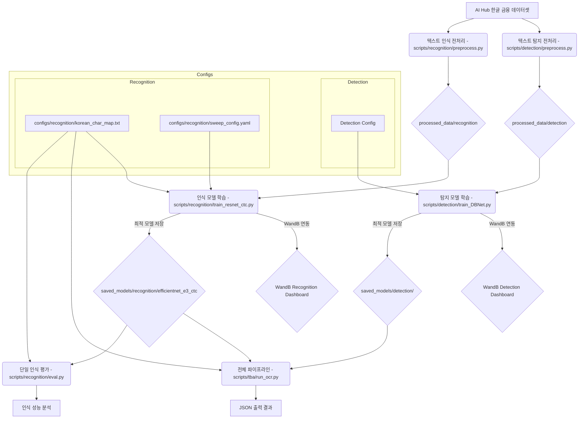

<h2>한글 금융 문서 OCR 인식 모델 가이드</h2>
작성자: Alpine_Dolce&nbsp;&nbsp;|&nbsp;&nbsp;최종 업데이트: 2025-09-11

<h2>문서 목표</h2>
이 문서는 한글 금융 문서 OCR 시스템의 텍스트 인식 모델 개발 과정을 상세히 다룹니다. 2단계 파이프라인(텍스트 탐지 + 텍스트 인식) 중 인식 단계에 해당하며, 탐지된 텍스트 영역에서 실제 한글/숫자 문자를 인식하는 모델의 개발, 학습, 평가 과정을 다룹니다.

**시스템 아키텍처:**
- **전체 시스템**: 2단계 OCR 파이프라인 (탐지 → 인식)
- **인식 모델**: EfficientNet-B3 + BiLSTM + CTC 아키텍처
- **대상 데이터**: AI Hub 한글 금융 문서 데이터셋 (은행 신고서, 보험 서류 등)
- **처리 언어**: 한국어 + 숫자 + 특수문자

**프로젝트 구조:**
```
FingSight-OCR-AlpineDolce/
├── data/                  # 원본 데이터셋 (학습/검증 이미지 및 라벨)
├── processed_data/        # 전처리된 데이터셋 (cropped images, labels.csv)
│   ├── detection/
│   └── recognition/
├── saved_models/          # 학습된 모델 가중치 저장
│   ├── detection/
│   └── recognition/
├── scripts/               # 각종 스크립트 (전처리, 학습, 평가 등)
│   ├── detection/           # 텍스트 탐지 모델 관련
│   │   ├── preprocess.py    # 탐지 데이터 전처리 
│   │   └── train_DBNet.py   # DBNet 탐지 모델 학습
│   ├── recognition/         # 텍스트 인식 모델 관련 
│   │   ├── preprocess.py    # 인식 데이터 전처리
│   │   ├── train_resnet_ctc.py # 메인 인식 모델 학습 스크립트
│   │   ├── eval.py          # 모델 평가/추론 스크립트
│   │   └── recognition_pipeline.py # 단일 인식 파이프라인
│   └── tba/
│       └── run_ocr.py       # 전체 OCR 파이프라인 (탐지 + 인식)
├── configs/               # 모델 및 학습 설정 파일
│   ├── detection/
│   └── recognition/
│       ├── sweep_config.yaml   # WandB 하이퍼파라미터 스윕 설정
│       └── korean_char_map.txt # 한국어 문자 맵 파일
├── output/                # 추론 결과, 시각화 등 출력
├── wandb/                 # WandB 로컬 로그 및 캐시
└── guide/ 
    ├── detection_Model.md 
    └── recognition_Model.md    # 현재 문서
```

**최종 목표:** 
1. **2단계 OCR 파이프라인** 구축: DBNet 기반 텍스트 탐지 + EfficientNet-B3+BiLSTM+CTC 기반 텍스트 인식
2. **한글 금융 문서 특화**: AI Hub 한글 금융 데이터셋에 최적화된 모델 개발
3. **실용적 성능**: 높은 정확도와 실시간 처리 가능한 경량화된 모델
4. **체계적 개발**: WandB를 통한 학습 과정 시각화 및 하이퍼파라미터 최적화
5. **완전한 파이프라인**: 원본 이미지 → 텍스트 탐지 → 텍스트 인식 → JSON 출력의 전 과정

**최신 명령어 예시 (2025-09-11 기준):**
```bash
# 인식 데이터 전처리
python scripts/recognition/preprocess.py --raw_data_dir "./data" --output_dir "./processed_data/recognition"

# 인식 모델 학습 (EfficientNet-B3 + BiLSTM + CTC)
# 인식 모델 학습 (EfficientNet-B3 + BiLSTM + CTC)
python scripts/recognition/train_efficientnet_e3_ctc.py --train_data_dir "processed_data/recognition/train_images" --val_data_dir "./processed_data/recognition/val_images" --save_dir "./saved_models/recognition/efficientnet_e3_ctc" --epochs 15 --batch_size 64 --lr 0.002 --wandb_project "FinSight-OCR-Recognition"

# 완전한 OCR 파이프라인 실행 (탐지 + 인식 + JSON 출력)
python scripts/tba/run_ocr.py --det_weights "saved_models/detection/dbnet_resnet18_best_RUN-ID.pth" --rec_weights "saved_models/recognition/efficientnet_e3_ctc/best_model.pth" --source "path/to/image.jpg" --char_map "configs/recognition/korean_char_map.txt"
```

---

### 전체 워크플로우 시각화:



---

### 1단계: 인식 데이터 전처리 (학습 전 필수 과정)

텍스트 인식 모델 학습을 위해서는 원본 금융 문서에서 텍스트 영역을 추출하고, 각 텍스트 영역에 해당하는 한글/숫자 라벨을 정리하는 과정이 필수적입니다. 이 단계는 AI Hub 한글 금융 데이터셋의 JSON 형식 주석을 처리하여 모델 학습에 적합한 형태로 변환합니다.

**데이터셋 특성:**
- **원본 데이터**: AI Hub OCR 데이터 (금융 및 물류)
- **문서 유형**: 은행 신고서, 보험 서류, 증권 서류 등
- **주석 형식**: JSON 파일 (바운딩 박스 + 텍스트)
- **언어**: 한국어 + 숫자 + 특수문자

- **사용 스크립트:** `scripts/recognition/preprocess.py`
- **실행 명령어:**
    ```bash
    python scripts/recognition/preprocess.py --raw_data_dir ./data --output_dir ./processed_data/recognition --val_split_ratio 0.1
    ```
- **인자 설명:**
    - `--raw_data_dir`: 원본 데이터셋이 위치한 디렉토리 경로.
    - `--output_dir`: 전처리된 데이터가 저장될 디렉토리 경로.
    - `--val_split_ratio`: 검증 데이터셋으로 분할할 비율 (예: 0.1은 10%를 검증용으로 사용).
- **작업 내용:** 원본 데이터셋(`--raw_data_dir`)을 읽어, 학습에 사용할 cropped image와 해당 이미지의 텍스트 라벨을 포함하는 `labels.csv` 파일을 생성합니다. 이 `labels.csv` 파일은 모델 학습의 핵심 입력 데이터가 됩니다.
- **출력 결과:**
    - `processed_data/train_images/`: 학습용 이미지 (`*.png`) 및 라벨 파일 (`labels.csv`) 생성
    - `processed_data/val_images/`: 검증용 이미지 (`*.png`) 및 라벨 파일 (`labels.csv`) 생성
- **`labels.csv` 형식:** `파일명,정답텍스트` (예: `IMG_..._0.png,동해시`)

---

### 2단계: 모델 학습 (WandB 연동)

- **사용 스크립트:** `scripts/recognition/train_efficientnet_e3_ctc.py`, `configs/recognition/sweep_config.yaml`, `configs/recognition/korean_char_map.txt`
- **모델 구조:** EfficientNet_b3 + BiLSTM + CTC
    - **선정 이유:** `EfficientNet_b3`는 정확도와 효율성 사이의 뛰어난 균형을 제공하는 백본으로, 손글씨 이미지에서 효과적인 특징 추출을 담당합니다. `BiLSTM`은 시퀀스 데이터인 텍스트의 문맥 정보를 파악하는 데 강점이 있으며, `CTC` (Connectionist Temporal Classification)는 길이 가변적인 텍스트 시퀀스를 직접 인식하는 데 최적화된 손실 함수입니다. 이 조합은 손글씨 OCR에서 높은 성능을 달성하는 검증된 아키텍처입니다.
- **주요 수정 사항:**
    - **백본 변경 (ResNet34 -> EfficientNet_b3):** 기존 ResNet34 백본을 `EfficientNet_b3`로 교체하여 모델의 특징 추출 능력을 강화하고, 정확도와 효율성 간의 균형을 최적화했습니다.
    - **GPU 기반 데이터 증강 (Kornia 활용):** 이미지 변환(회전, 원근, 밝기/대비, 블러, 지우기)을 CPU에서 GPU로 옮겨 CPU 병목 현상을 해소하고, 데이터 로딩 속도를 크게 향상시켰습니다.
    - **학습 시간 단축:**
        - **혼합 정밀도 학습 (AMP):** `torch.cuda.amp`를 사용하여 FP16 연산을 도입, GPU 연산 속도를 높이고 VRAM 사용량을 절약했습니다.
        - **그래디언트 누적:** 실제 배치 사이즈를 늘리지 않고도 더 큰 배치 효과를 시뮬레이션하여 메모리 효율성을 유지하면서 학습 안정성을 높였습니다.
        - **`num_workers` 및 `pin_memory` 최적화:** `DataLoader`의 `num_workers`를 CPU 코어 수에 맞춰 늘리고 `pin_memory=True`를 설정하여 데이터 로딩 병목 현상을 최소화했습니다.
    - **데이터 로더:** 1단계에서 생성된 `labels.csv` 파일을 읽어 학습 및 검증 데이터로 사용하도록 구현되었습니다.
    - **문자 맵 파일 (`korean_char_map.txt`):** 모델이 인식할 문자의 집합을 정의하는 데 사용되는 필수 파일입니다.
    - **WandB 연동:**
        - 학습/검증 손실(loss), 정확도(accuracy) 등 주요 지표를 실시간으로 차트로 기록하여 학습 과정을 투명하게 시각화합니다.
        - 매 검증 단계마다, 일부 예측 샘플을 (이미지, 정답, 예측값) 테이블 형태로 기록하여 모델의 정성적 성능을 시각적으로 확인합니다.
        - **WandB Sweeps 연동:** 하이퍼파라미터 튜닝 과정을 자동화하여 최적의 하이퍼파라미터 조합을 효율적으로 탐색할 수 있도록 합니다.
    - **일반화 성능 개선:**
        - **가중치 감쇠 (`weight_decay`):** L2 정규화를 통해 모델의 과적합을 방지하고 일반화 성능을 향상시킵니다. (WandB Sweep으로 튜닝)
        - **드롭아웃 추가:** LSTM 출력 후 드롭아웃을 적용하여 뉴런 간의 과도한 의존성을 줄이고 과적합을 방지합니다. (WandB Sweep으로 튜닝)
        - **학습률 스케줄러 (`lr`, `--min_lr`, `T_0`, `T_mult`):** `CosineAnnealingWarmRestarts`로 변경하여 학습률을 동적으로 조절하고, 모델이 더 평평한 최적점을 찾도록 유도하여 안정적인 수렴과 일반화 성능을 돕습니다. (WandB Sweep으로 `lr`, `T_0`, `T_mult` 튜닝)
        - **조기 종료 (`--patience`):** 검증 손실이 일정 에포크 동안 개선되지 않으면 학습을 조기 종료하여 불필요한 학습과 과적합을 방지합니다. (기본값: `10`)
        - **고급 데이터 증강:** `RandomAffine` (회전 각도 확장), `RandomPerspective`, `GaussianBlur`, `ColorJitter`, **`RandomErasing`** 등을 적용하여 모델의 강건성과 일반화 성능을 극대화합니다.
    - **최고 모델 저장:** 검증 손실이 가장 낮은 모델을 `saved_models/recognition/efficientnet_e3_ctc/best_model.pth`로 별도 저장합니다. (WandB Sweeps 실행 시 `wandb.run.id`가 포함된 고유한 파일명으로 저장되어 덮어쓰기 방지)

- **실행 방법 1 (WandB Sweeps):**
    1.  **스윕 ID 생성:**
        ```bash
        wandb sweep configs/recognition/sweep_config.yaml
        ```
        (이 명령어 실행 후 출력되는 `<SWEEP_ID>`를 복사해 두세요.)
    2.  **스윕 에이전트 실행:**
        ```bash
        wandb agent <SWEEP_ID>
        ```
        (여러 개의 터미널에서 이 명령어를 실행하여 동시에 여러 실험을 진행할 수 있습니다.)

- **실행 방법 2 (Script 실행):**
```bash
python scripts/recognition/train_efficientnet_e3_ctc.py --train_data_dir processed_data/recognition/train_images --val_data_dir processed_data/recognition/val_images --save_dir "saved_models/recognition/efficientnet_e3_ctc" --epochs 15 --batch_size 64 --lr 0.002 --wandb_project "FinSight-OCR-Recognition"
```
---


### 3단계: 성능 평가 (학습 완료 후 진행)

학습된 인식 모델의 성능을 **정성적(qualitative)** 및 **정량적(quantitative)**으로 평가합니다. `eval.py` 스크립트는 단일 이미지에 대한 빠른 테스트와 전체 데이터셋에 대한 체계적인 평가를 모두 지원합니다.

- **사용 스크립트:** `scripts/recognition/eval.py`

<h4>모드 1: 단일 이미지 테스트 (정성 평가)</h4>

개별 이미지에 대한 모델의 예측 결과를 즉시 확인하고 시각화합니다.

- **작업 내용:** 특정 이미지 하나를 모델에 입력하여 예측된 텍스트를 출력하고, 예측 결과를 원본 이미지 위에 시각화하여 저장합니다.
- **실행 명령어:**
    ```bash
    python scripts/recognition/eval.py --weights "saved_models/recognition/efficientnet_e3_ctc/best_model.pth" --source "path/to/test_image.png" --img_h 64 --lstm_layers 2 --lstm_hidden_size 256
    ```
- **출력:** 콘솔에 예측된 텍스트가 출력되고, `output/recognition` 폴더에 결과 이미지가 저장됩니다.

<h4>모드 2: 전체 데이터셋 평가 (정량 평가)</h4>

검증 또는 테스트 데이터셋 전체에 대한 모델의 종합적인 성능을 객관적인 수치로 평가합니다.

- **작업 내용:** 지정된 폴더의 모든 이미지에 대해 예측을 수행하고, `labels.csv` 파일의 정답과 비교하여 아래의 핵심 성능 지표를 계산합니다.
    - **정확도 (Sequence Accuracy):** 예측된 문장과 정답 문장이 100% 일치하는 샘플의 비율. (높을수록 좋음)
    - **문자 에러율 (Character Error Rate, CER):** 예측이 정답과 얼마나 다른지를 문자 단위로 측정한 비율. (낮을수록 좋음)
- **실행 명령어:**
    ```bash
    python scripts/recognition/eval.py --weights "saved_models/recognition/efficientnet_e3_ctc/best_model.pth" --source "processed_data/recognition/val_images" --label_csv "processed_data/recognition/val_images/labels.csv" --img_h 64 --lstm_layers 2 --lstm_hidden_size 256
    ```
- **출력:**
    - 콘솔에 최종 정확도와 평균 CER이 리포트됩니다.
    - 예측이 틀린 샘플들은 `output/recognition/errors` 폴더에 시각화된 이미지로 자동 저장되어, 모델의 취약점을 쉽게 분석할 수 있습니다.

- **주요 인자:**
    - `--weights`: 평가할 모델의 `.pth` 파일 경로. **(필수)**
    - `--source`: 평가할 이미지 파일 또는 디렉토리 경로. **(필수)**
    - `--output_dir`: 결과 이미지를 저장할 디렉토리 (기본값: `output/recognition`).
    - `--label_csv`: (데이터셋 평가용) 정답 라벨이 포함된 `.csv` 파일 경로.
    - `--img_h`: 이미지 높이 (기본값: `64`).
    - `--lstm_layers`: LSTM 레이어 수 (기본값: `2`).
    - `--lstm_hidden_size`: LSTM 히든 사이즈 (기본값: `256`).
    - `--save_all_visualizations`: (데이터셋 평가용) 예측 성공/실패와 관계없이 모든 샘플의 시각화 결과를 저장할지 여부.


---

### 4단계: 완전한 OCR 파이프라인 실행

학습된 탐지 모델과 인식 모델을 결합하여 전체 OCR 파이프라인을 실행합니다.

- **사용 스크립트:** `scripts/tba/run_ocr.py`
- **실행 명령어:**
    ```bash
    python scripts/tba/run_ocr.py --det_weights "saved_models/detection/dbnet_resnet18_best_RUN-ID.pth" --rec_weights "saved_models/recognition/efficientnet_e3_ctc/best_model.pth" --source "C:/Users/Admin/Documents/github/FinSight-OCR-AlpinaDolce/data/Validation/01.원천데이터/VS_금융_1.은행_1-2.신청서/IMG_OCR_6_F_0001310.png" --char_map "configs/recognition/korean_char_map.txt" --img_h 64 --lstm_layers 2 --lstm_hidden_size 256
    ```

    
- **출력 결과:**
    - 시각화된 결과 이미지 (바운딩 박스 + 인식된 텍스트)
    - 구조화된 JSON 파일 (좌표 + 텍스트 + 신뢰도)

**JSON 출력 예시:**
```json
{
  "metadata": {
    "source_image": "path/to/image.png",
    "processed_at": "2025-09-11T15:17:03.437088",
    "total_detections": 16
  },
  "detections": [
    {
      "id": 1,
      "text": "서울특별시",
      "confidence": 0.98,
      "bbox": {
        "coordinates": [[x1,y1], [x2,y2], [x3,y3], [x4,y4]],
        "type": "polygon"
      }
    }
  ]
}
```

---

### 최신 명령어 예시 (2025-09-11 기준)

**인식 모델 평가:**
```bash
python scripts/recognition/eval.py \
    --weights "saved_models/recognition/resnet_ctc/best_model.pth" \
    --source "test_image.png" \
    --lstm_layers 2 \
    --lstm_hidden_size 256 \
    --img_h 64
```

**인식 모델 학습:**
```bash
python scripts/recognition/train_resnet_ctc.py \
    --train_data_dir "processed_data/recognition/train_images" \
    --val_data_dir "processed_data/recognition/val_images" \
    --img_h 64 \
    --batch_size 64 \
    --target_width 400 \
    --epochs 15 \
    --patience 10 \
    --lr 0.002
```

**탐지 모델 학습 (200분할 방식):**
```bash  
python scripts/detection/train_DBNet.py \
    --data_dir "processed_data/detection" \
    --save_dir "saved_models/detection" \
    --backbone "resnet18" \
    --epochs 200 \
    --batch_size 8 \
    --wandb_project "FinSight-OCR-Detection"
```